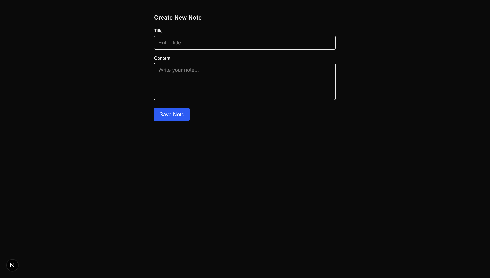
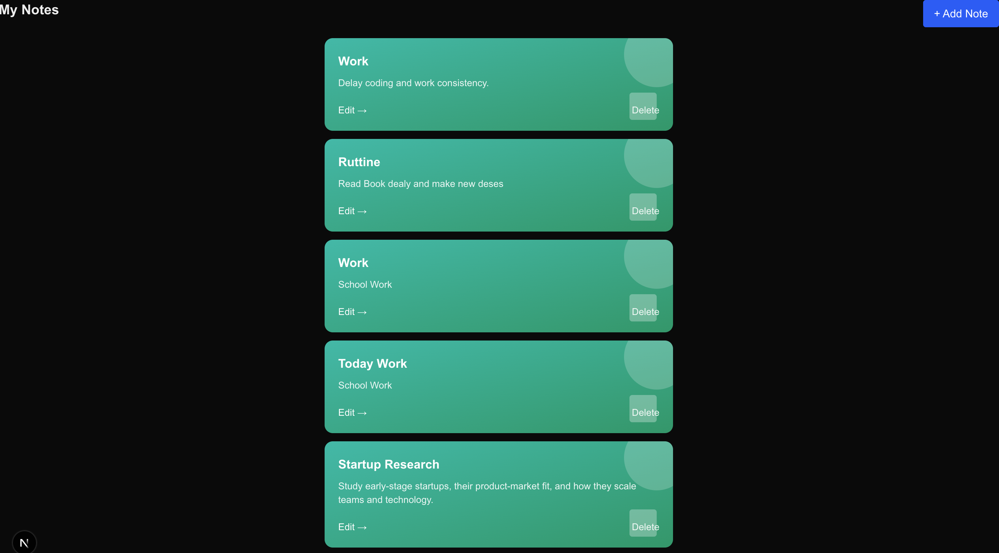
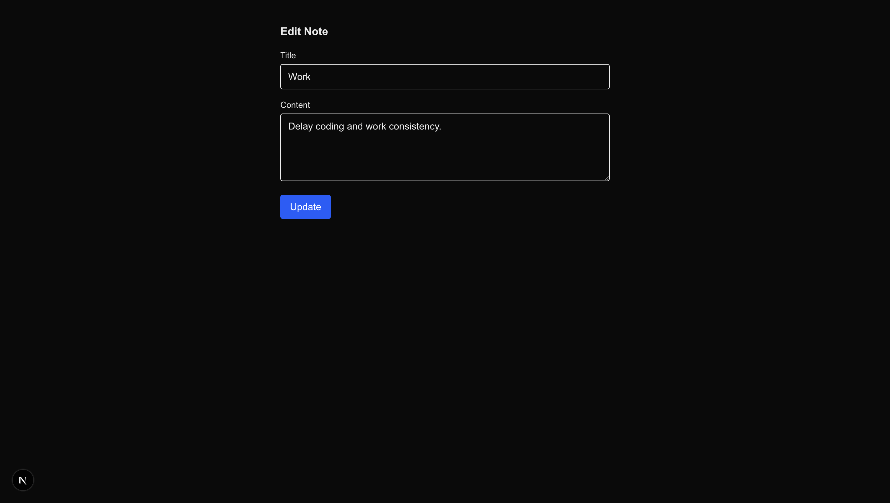

# Notes App (Full Stack)

A simple full-stack Notes application built using **Next.js** and **MongoDB**.  
Users can create, view, edit, and delete notes easily through a clean UI.

This project was built as part of an internship assignment to demonstrate
basic full-stack development skills.

## Screenshots





---

## Features

- Create a new note  
- View all notes  
- Edit an existing note  
- Delete a note  
- Each note includes:
  - Title
  - Content
  - Creation timestamp

---

## Tech Stack

- **Next.js** – Frontend & Backend (API Routes)
- **MongoDB** – Database
- **Mongoose** – MongoDB ODM
- **Tailwind CSS** – Styling

---

## Project Structure (Simplified)

src/
├── app/
│ ├── page.js // Home page (list notes)
│ ├── create/page.js // Create note
│ ├── edit/[id]/page.js // Edit note
│ └── api/notes/ // Backend APIs
│
├── components/
│ └── NoteCard.js
│
├── lib/
│ └── mongodb.js
│
└── models/
└── Note.js

---

## How to Run Locally

1. Clone the repository  
git clone <https://github.com/firdoshalam7786/notes-fullstack-app>

markdown
Copy code

2. Install dependencies  
npm install

csharp
Copy code

3. Create a `.env.local` file in the root folder and add:
MONGODB_URI=your_mongodb_connection_string

4. Start the development server  
npm run dev

markdown
Copy code

5. Open in browser  
http://localhost:3000

yaml
Copy code

---

## Usage

- Click **Add Note** to create a new note  
- Click **Edit** to update an existing note  
- Click **Delete** to remove a note  

All changes are saved in MongoDB.

---

## Status

✔ Assignment completed  
✔ All required features implemented  
✔ Fully functional CRUD application  

---

## Notes

- `.env.local` is not committed to GitHub for security reasons.
- The UI is intentionally kept simple and clean.

---

## Author

Built by **Firdosh Alam**  


This is a [Next.js](https://nextjs.org) project bootstrapped with [`create-next-app`](https://github.com/vercel/next.js/tree/canary/packages/create-next-app).

## Getting Started

First, run the development server:

```bash
npm run dev
# or
yarn dev
# or
pnpm dev
# or
bun dev
```

Open [http://localhost:3000](http://localhost:3000) with your browser to see the result.

You can start editing the page by modifying `app/page.js`. The page auto-updates as you edit the file.

This project uses [`next/font`](https://nextjs.org/docs/app/building-your-application/optimizing/fonts) to automatically optimize and load [Geist](https://vercel.com/font), a new font family for Vercel.

## Learn More

To learn more about Next.js, take a look at the following resources:

- [Next.js Documentation](https://nextjs.org/docs) - learn about Next.js features and API.
- [Learn Next.js](https://nextjs.org/learn) - an interactive Next.js tutorial.

You can check out [the Next.js GitHub repository](https://github.com/vercel/next.js) - your feedback and contributions are welcome!

## Deploy on Vercel

The easiest way to deploy your Next.js app is to use the [Vercel Platform](https://vercel.com/new?utm_medium=default-template&filter=next.js&utm_source=create-next-app&utm_campaign=create-next-app-readme) from the creators of Next.js.

Check out our [Next.js deployment documentation](https://nextjs.org/docs/app/building-your-application/deploying) for more details.
